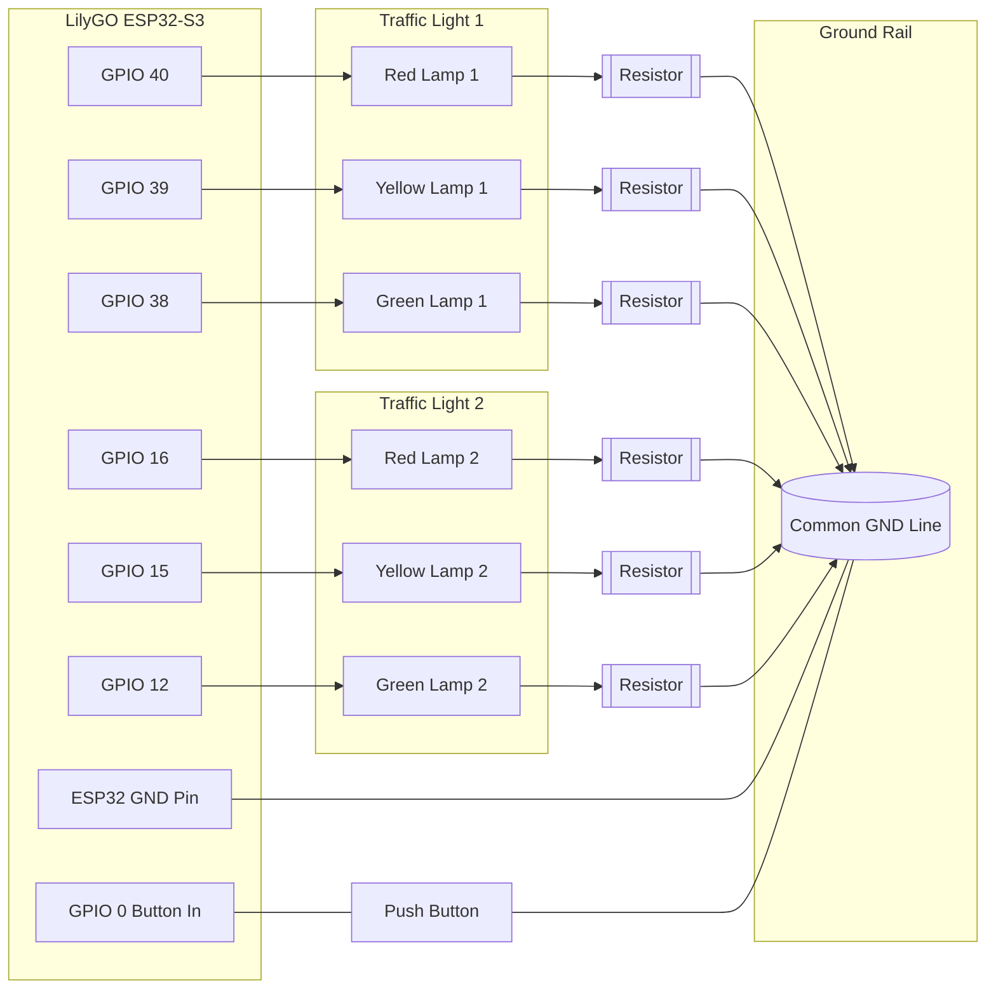

# Traffic Circuit Diagram (Editable)

## 1) Wiring Overview

- Board: LilyGO ESP32-S3 (T3-S3)
- Logic style: GPIO pin drives lamp plus side directly
- Return path: lamp minus side -> resistor -> GND rail -> ESP32 GND pin

## 2) Pin Mapping From Current Code

- Traffic Light 1
- GPIO 40 -> Red lamp (+)
- GPIO 39 -> Yellow lamp (+)
- GPIO 38 -> Green lamp (+)

- Traffic Light 2
- GPIO 16 -> Red lamp (+)
- GPIO 15 -> Yellow lamp (+)
- GPIO 12 -> Green lamp (+)

- Button input
- GPIO 0 -> Button (INPUT_PULLUP in software)

## 3) Circuit Diagram (Mermaid)

## External Button

The External Button was connected on GPIO 42. Sadly it brock. But for this we used the 3.3V rail from the esp for power a resistor to ground and conected the button as a Push-down. I didnt include it in the diagram as i didnt used it in the, but instead i used the internal button on the esp witch is in the diagram included.
