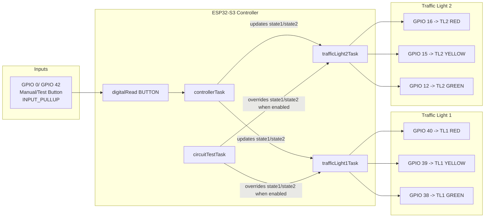

# Traffic System UML

This diagram is generated from the current codebase implementation.

## 1) Class/Responsibility View

```mermaid
classDiagram
    class Main {
      +setup()
      +loop()
    }

    class TrafficControllerData {
      +TrafficLightState state1
      +TrafficLightState state2
      +uint8_t mode
      +uint8_t controlMode
      +uint8_t phaseIndex
      +SemaphoreHandle_t mutex
    }

    class TrafficController {
      +initTrafficController(mode, controlMode)
      +startTrafficSystem(mode, controlMode)
      +getControllerData()
      +MyCircuitTest_Enable()
      +MyCircuitTest_Disable()
      +setTrafficLightLED(redPin, yellowPin, greenPin, state)
      +controllerTask(void*)
      +trafficLight1Task(void*)
      +trafficLight2Task(void*)
      +circuitTestTask(void*)
    }

    class GPIO {
      +digitalWrite(pin, value)
      +digitalRead(pin)
      +pinMode(pin, mode)
    }

    class FreeRTOS {
      +xTaskCreate(...)
      +vTaskDelay(...)
      +xSemaphoreTake(...)
      +xSemaphoreGive(...)
    }

    Main --> TrafficController : calls startTrafficSystem()
    TrafficController --> TrafficControllerData : reads/writes shared state
    TrafficController --> GPIO : controls and reads pins
    TrafficController --> FreeRTOS : tasks + synchronization
```

## 2) Port-to-Light Interaction View

## 3) Mode Behavior Summary

- Mode 0: Automatic sequence only.
- Mode 1: Manual stepping on button press.
- Mode 2: Automatic sequence, and while button is held the circuit test task pattern takes control.

## 4) Notes

- Button pin in current code is GPIO 0.
- The previously used GPIO 41 line is currently commented out in source.
